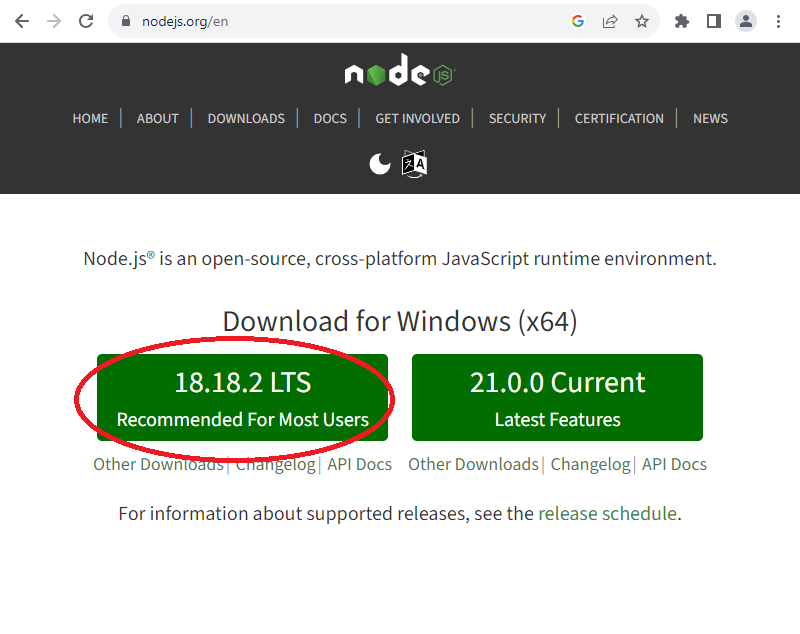
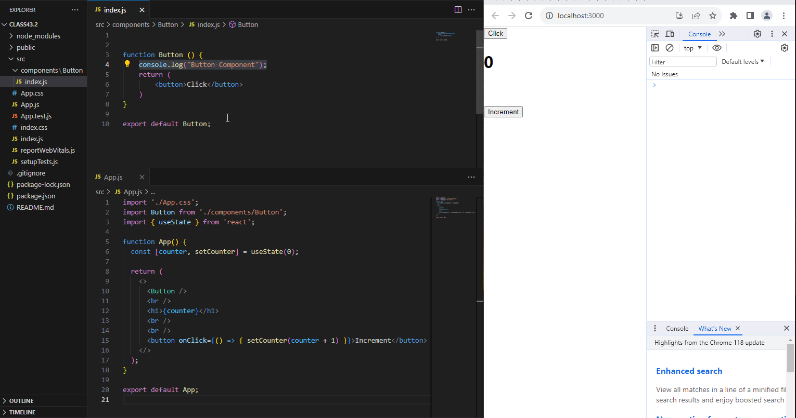
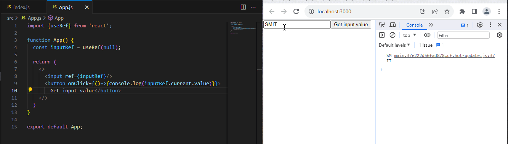
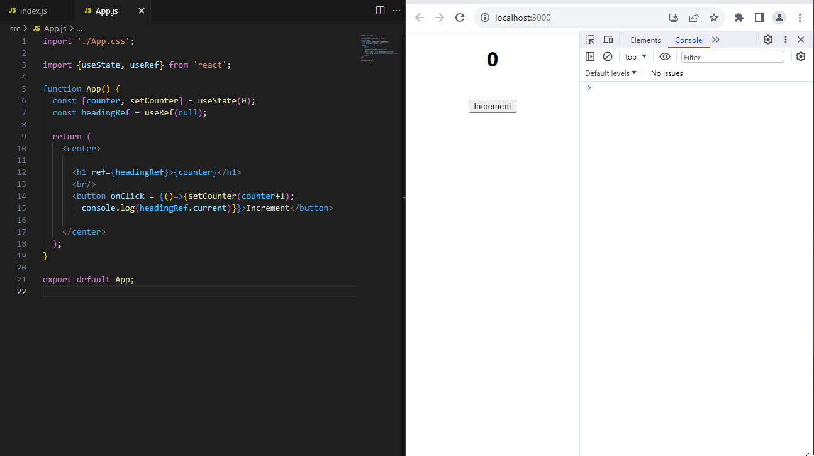
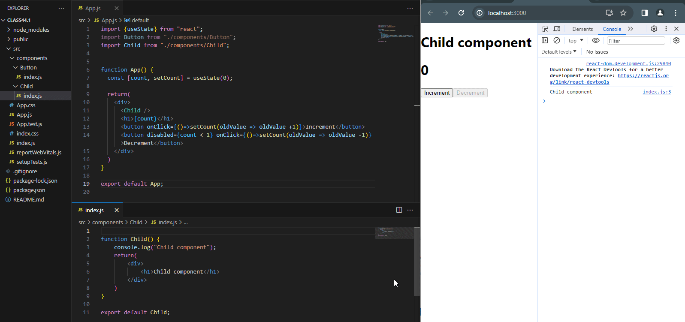
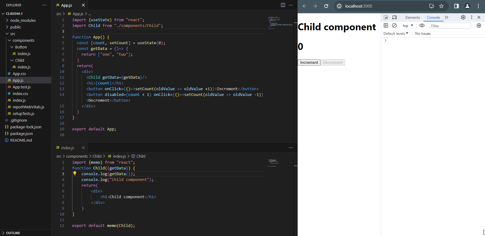

# Learning React with create-react-app
Documentation

# Table of Content

|Topics|
|----------|
|[Introduction](#introduction)|
|[Installation and Setup](#installation-and-setup)|
|[Start a new React Project](#start-a-new-react-project)|
|[Code Structure](#code-structure)|
|[JSX](#jsx)|
|[Components](#components)|
|[Props](#props)|
|[State](#state)|
|[List Rendering](#list-rendering)|
|[Conditional Rendering](#conditional-rendering)|
|[Hooks](#hooks)|
|[Routing](#routing)|
|[Installation of other Libraries](#installation-of-other-libraries)|
|[Context API](#context-api)|
|[Redux](#redux)|
|[Axios](#axios)|

---


# Introduction
React is an open-source front-end JavaScript library created by META (formerly facebook). React is used for building userinterfaces  web and mobile applications by creating UI components. React can be used to create
- Single page applications
- Mobile applications
- Web applications
- Server-rendered applications
React also have support powerful framework's support like Next.js

[Back to the Top](#table-of-content)

---
# Installation and Setup
To start a react project you must have *nodeJS* installed in your PC. To install NodeJS, go to the official website of nodejs https://nodejs.org/en
Here as shown in the picture below. Download and install the **LTS verstion** not the Current. You might have a different version from mine at that time when you are going through.


[Back to the Top](#table-of-content)

---

# Start a new React Project
Now you have installed **nodeJS** which give *npm* command. We can create a new REACT Project with this command
```
npm i -g create-react-app
```
this will install the library **create-react-app** in our computer globally (the -g flag is for globally, mean all the user of a PC can have the installed library)
Then, create a react project with create-react-app
```
create-react-app projectName
```

AND the another, easier way to create a REACT project, We have just one command
```
npx create-react-app projectName
```
by this command,
- we do not need to install the library in our PC locally, so, we save our storage by this means.
- the *npx* command here mean **Node Package eXecute**, also comes with *npm* command from nodejs. It can execute any package from the npm registry directly without even instally the package.


[Back to the Top](#table-of-content)

---
# Code Structure

[Back to the Top](#table-of-content)

---
# JSX

[Back to the Top](#table-of-content)

---
# Components

[Back to the Top](#table-of-content)

---

# Props

[Back to the Top](#table-of-content)

---

# State

[Back to the Top](#table-of-content)

---
# List Rendering

[Back to the Top](#table-of-content)

---

# Conditional Rendering

[Back to the Top](#table-of-content)

---
# Hooks

## React.memo
###### App.js
```JavaScript
//--App.js--
import './App.css';
import Button from './components/Button';
import { useState } from 'react';

function App() {
  const [counter, setCounter] = useState(0);
  return (
    <>
      <Button />
      <br />
      <h1>{counter}</h1>
      <br />
      <br />
      <button onClick={() => { setCounter(counter + 1) }}>Increment</button>
    </>
  );
}
export default App;
```

###### componenets/Button/index.js
```JavaScript
//--components/Button/index.js--

function Button () {
    console.log("Button Component");
    return (
        <button>Click</button>
    )
}
export default Button;
```
But, if we don't want to render the button component every time. So, we use the *React Hook* **React.memo**. It memorises the component and do not let them to be rendered, every time when state changes but, only once at first time render.
Here, look the variation in the code of Button component.
to use **React.memo**, we have to first import. So, added the line

`import React from "react";`

Then, we use React.memo exactly where we are exporting the component like this

`export default React.memo(Button)`

See the complete code with changes.

```JavaScript
//--components/Button/index.js--
import React from "react";
function Button () {
    console.log("Button Component");
    return (
        <button>Click</button>
    )
}
export default React.memo("Button");
```
Here is the glimpse of the working code.


## useRef
### Example 1
using useRef hook get the value from input field.

###### App.jsx
```JavaScript
//--App.js--
import {useRef} from 'react';

function App() {
  const inputRef = useRef(null);

  return (
    <>
      <input ref={inputRef}/>
      <button onClick={()=>{console.log(inputRef.current.value)}}>Get input value</button>
    </>
  )
}

export default App;
```



### Example 2
using useRef hook get a DOM element.

The previous code for counter, in which on every click on "Increment" button, the counter increments by 1 because of changing state using **useState** React hook.
Here I am using **useRef** to get the DOM element.

```JavaScript
//--App.js--
import './App.css';

import {useState, useRef} from 'react';

function App() {
  const [counter, setCounter] = useState(0);
  const headingRef = useRef(null);

  return (
    <>
      <h1 ref={headingRef}>{counter}</h1>
      <br/>
      <button onClick = {()=>{setCounter(counter+1); console.log(headingRef.current)}}>Increment</button>

    </>
  );
}

export default App;

```



## useCallback
You have seen the application of **React.memo** or simply **memo** that how it avoids unnecessary rendering by memorizing the rendered output. It improves the performance by memorizing the result and skip the last rendered result. Any component that put into **memo** method of **React** will not be re-rendered by with the re-rendering of main component of App because of **state change**. 
See below the example of **memo** usage again;

### Example 1: using memo avoid re-rendering

###### App.js
```JavaScript
import {useState} from "react";
import Button from "./components/Button";
import Child from "./components/Child";


function App() {
  const [count, setCount] = useState(0);

  return(
    <div>
      <Child />
      <h1>{count}</h1>
      <button onClick={()=>setCount(oldValue => oldValue +1)}>Increment</button>
      <button disabled={count < 1} onClick={()=>setCount(oldValue => oldValue -1)}>Decrement</button>
    </div>
  )
}

export default App;
```

###### ./src/componenets/Button/index.js
```JavaScript
import {memo} from "react";
function Child() {
    console.log("Child component");
    return(
        <div>
            <h1>Child component</h1>
        </div>
    )
}

export default memo(Child);
```


## BUT...
How long **memo** avoids the re-rendering of a component?
If a prop of a function or object is passed to the memorized component. Then it will **re-render** again with the re-rendering of the main component.

consider this code and its demo.
###### App.js
```JavaScript
import {useState} from "react";
import Child from "./components/Child";

function App() {
  const [count, setCount] = useState(0);
  const getData = ()=> {
    return ["one", "two"];
  }
  return(
    <div>
      <Child getData={getData}/>
      <h1>{count}</h1>
      <button onClick={()=>setCount(oldValue => oldValue +1)}>Increment</button>
      <button disabled={count < 1} onClick={()=>setCount(oldValue => oldValue -1)}>Decrement</button>
    </div>
  )
}

export default App;
```

###### ./src/components/Child/index.js
```JavaScript
import {memo} from "react";
function Child({getData}) {
    console.log(getData());
    console.log("Child component");
    return(
        <div>
            <h1>Child component</h1>
        </div>
    )
}
export default memo(Child);
```



[Back to the Top](#table-of-content)

---

# Routing

[Back to the Top](#table-of-content)

---

# Installation of Other Libraries

[Back to the Top](#table-of-content)

---

# Context API

[Back to the Top](#table-of-content)

---

# Redux

[Back to the Top](#table-of-content)

---

# Axios

[Back to the Top](#table-of-content)

---
